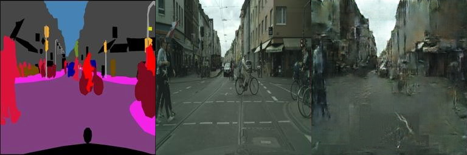

# Assignment 3 - Play with GANs

### In this assignment, you will implement two methods for using GANs in digital image processing.

### Resources:
- [DragGAN](https://vcai.mpi-inf.mpg.de/projects/DragGAN/): [Implementaion 1](https://github.com/XingangPan/DragGAN) & [Implementaion 2](https://github.com/OpenGVLab/DragGAN)
- [Facial Landmarks Detection](https://github.com/1adrianb/face-alignment)

---

## 1. Increment hw2 with Discriminative Loss.
# 算法设计

## 网络架构

本项目采用了条件生成对抗网络（cGAN）的结构，旨在将边缘图转换为相应的照片。该网络主要由两个部分组成：**生成器（Generator）**和**判别器（Discriminator）**。

- **生成器**：基于U-Net架构构建，它包含一个编码器和一个解码器。编码器负责从输入图像中提取特征，而解码器则利用这些特征来合成新的图像。为了更好地保持图像的低层次细节，我们引入了跳跃连接（skip connections），使得编码器中的低层特征可以直接传递到解码器的相应层级。

- **判别器**：采用了PatchGAN的设计理念，专注于判断图像的小块区域（patches）是来自真实数据集还是由生成器创建的。这种方式有助于生成更加细致且真实的图像纹理。

## 训练过程

训练过程中，生成器和判别器的参数会交替更新，以实现两者的对抗性学习：

1. **更新判别器**：
   - 在此步骤中，生成器的参数被固定，我们仅更新判别器的参数。
   - 目标是提高判别器区分真实图像与生成图像的能力。

2. **更新生成器**：
   - 接下来，我们固定判别器的参数，并对生成器进行优化。
   - 目的是让生成器能够生成更逼真的图像，从而欺骗判别器，使其难以区分生成图像与真实图像之间的差异。

通过上述流程，生成器和判别器在训练过程中不断相互竞争、共同进步，最终达到一个平衡点，此时生成器可以生成高质量的图像，而判别器也具备了较强的辨别能力。

## 损失函数

### 实验结果
训练集结果
epoch=200时

对于测试集的运行结果为：
epoch=200时

## 2. Combine DragGAN with Automatic Face Landmarks.

将DragGan和Automatic Face Landmarks 相结合，得到实验结果如下：

打开界面时会进行自动描点

Smile：

Thinning face：

